# opencad-landsurvey-plugin

A **Land Survey** add-on for [Open CAD Studio](https://github.com/HakanSeven12/OpenCADStudio),
distributed as a prebuilt dynamic library (`cdylib`) via GitHub Releases.

It depends only on `ocs_plugin_api` (the host's stable contract crate) and
`acadrust` (the host's entity model) — never on the OpenCADStudio binary — and
exports the two C symbols the host loader expects (via
`ocs_plugin_api::export_plugin!`). It adds a **Land Survey** ribbon tab with:

- **Points** — PNEZD CSV import and a point list.
- **Surface** — build a TIN from PNEZD or **LandXML**; surface-to-surface and
  surface-to-datum **earthwork volumes** (exact TIN overlay + grid method) with
  drawn TINs, cut/fill lines, and result labels.
- **COGO** — inverse (distance / azimuth / bearing).
- **Transform** — **RTS** (rotate / translate / scale) and a least-squares
  **Helmert** fit from control pairs, with a 7-step explainer and annotated,
  drawn stages.
- **Resection** — free-station: solve an occupied (unknown) point from shots to
  known control — **combined** (direction + distance, least-squares; reuses the
  Helmert engine, with an EDM scale check) or **angle-only** three-point
  (Tienstra, with danger-circle detection). Draws the station, rays to each
  known point, and residuals. See [`docs/resection-design.md`](docs/resection-design.md)
  and the [`docs/examples/resection-demo.csv`](docs/examples/resection-demo.csv) seed.
- **Plan** — recognized-plan (`plan2cad` JSON) import.
- **Animated SVG explainers** — Helmert / RTS / inverse / resection can emit a
  self-contained looping SVG that shows the operation step by step (with a
  `teach` mode that amplifies near-grid transforms for classroom / outreach
  use). Each is data-driven from real input; reproducible seeds and the exact
  regeneration commands are in [`docs/examples/`](docs/examples/README.md).

See [`PLUGIN.md`](PLUGIN.md) for the full command and XDATA reference.

## Explainers

Each transform / COGO operation can emit a self-contained, looping SVG rendered
from the **actual** input — handy for QA, teaching, and outreach. These are the
committed demo renders; the seeds and exact commands are in
[`docs/examples/`](docs/examples/README.md).

| Helmert fit | Resection (free-station) |
|:---:|:---:|
|  |  |
| **RTS** (rotate/translate/scale) | **COGO inverse** |
|  |  |

## Layout

```
opencad-landsurvey-plugin/
  Cargo.toml            # workspace root: the cdylib package + acadrust patch
  plugin.toml           # shipped beside the binary; mirrors the in-code MANIFEST
  src/
    lib.rs              # manifest, BuiltinPlugin entry point, export_plugin!
    ribbon.rs           # the "Land Survey" CadModule tab
    dispatch.rs         # LS_* command routing → acadrust entities + XDATA
    state.rs            # per-tab plugin state
  crates/
    landsurvey/         # Layer-C engine: COGO, PNEZD, plan, LandXML, TIN/volume,
                        #   conformal transform, DXF writer (std + serde)
    landsurvey-cli/     # headless CLI over the engine — run + dump DXF, no host
```

The split mirrors the three-layer model in OpenCADStudio's
`docs/plugin-architecture.md`: the host (Layer A) loads this cdylib (Layer B),
which calls the host-free engine crate (Layer C). The engine carries the unit
tests and can be reused from a CLI or WASM build.

## Releases

Pushing a `v*` tag runs `.github/workflows/release.yml`, which builds the cdylib
on Linux/Windows/macOS and uploads each binary plus `plugin.toml` as release
assets. The host picks the asset matching the user's OS/arch and reads
`plugin.toml` for the API-version compatibility check.

> Approach B: the binary must be built against the same toolchain and
> `ocs_plugin_api` / `acadrust` versions as the host. The
> `ocs_plugin_api_version` symbol gates the API version at load time.

## License

GPL-3.0-only, matching Open CAD Studio.
